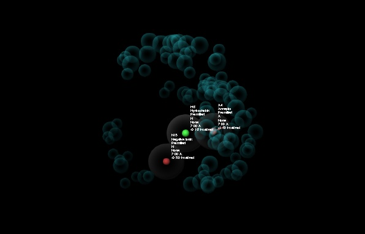

# In_Silico_SLC7A11_Drug_Discovery
Computer-Aided Drug Design (CADD) pipeline for the identification of ferroptosis-inducing compounds targeting the SLC7A11 protein.

## 📌 Project Overview
Therapy resistance remains a critical bottleneck in oncology, often driven by the upregulation of antioxidant defense mechanisms. The cystine/glutamate antiporter **SLC7A11** (xCT) plays a pivotal role in maintaining intracellular glutathione (GSH) levels, shielding cancer cells from oxidative stress. 

This project utilizes a Computer-Aided Drug Design (CADD) pipeline to identify novel small-molecule inhibitors of SLC7A11. By blocking cystine uptake, these compounds aim to deplete GSH, elevate lipid peroxides, and selectively trigger **ferroptosis**—an iron-dependent form of regulated cell death—in therapy-resistant cancer phenotypes.

## 🛠️ Computational Toolkit
* **Platform:** Schrödinger Maestro Suite (Desktop Version), ChemDraw, & Web-based Predictors
* **Environment:** Windows 11 
* **Key Modules & Tools:**
  * **Protein Preparation Wizard:** Receptor optimization
  * **LigPrep:** Ligand ionization and stereoisomer generation
  * **QikProp:** Physics-based ADMET descriptor prediction
  * **ADMETlab 2.0:** ADMET & profiling 
  * **Phase:** Pharmacophore hypothesis modeling
  * **Glide:** Molecular Docking (HTVS/SP/XP) 
  * **Prime MM-GBSA:** Binding free energy estimation
  * **ChemDraw Professional (v15.0):** Structural modification & rational lead optimization

    ---

## 🧬 Molecular Workflow & Protocols
### 1. Protein Preparation
The cryo-EM structure of the human cystine-glutamate antiporter SLC7A11 was retrieved from the Protein Data Bank (**PDB ID: 7EPZ**). 

For the simulation environment, **Chain B** was isolated and processed using the **Schrödinger Protein Preparation Wizard** through the following protocol:
* **Bond Orders:** Assigned bond orders and utilized the Chemical Component Dictionary (CCD) database for accuracy.
* **Hydrogen Addition:** Hydrogens were added to the structure to satisfy valency requirements (without removing original hydrogens).
* **Structural Bonds:** Generated zero-order bonds to metals and created disulfide bonds to ensure proper structural integrity.
* **Epik Optimization:** Heteroatom ionization and tautomeric states were generated using Epik at a physiological pH range of $7.0 \pm 2.0$.

### 2. Ligand Preparation (LigPrep)
A library of **5,100 screening compounds** was obtained from **FutureGRIN NextGen**. Upon structural verification during workspace import, **5,089 compounds** were successfully integrated into Maestro, with 11 structurally invalid entries omitted.

The chemical library was then prepared using **Schrödinger LigPrep** to generate high-quality 3D structures ready for computational screening under the following criteria:
* **Force Field:** The **OPLS4** force field was applied for geometric energy minimization.
* **Ionization Treatment:** The structures were explicitly **neutralized** during preparation.
* **Salt Removal:** The `Desalt` option was enabled to remove counterions and isolate the parent therapeutic fragments. Tautomer generation was deactivated.
* **Stereochemistry:** Chiral centers were handled using the `Retain specified chiralities (vary other chiral centers)` protocol to preserve the core configurations defined by the source library.

  ### 3. Early Drug-Likeness Filtering & Database Screening

To systematically narrow down the screening library to the most viable starting candidates before molecular docking, a multi-stage filtering funnel was applied.

The **5,089** prepared ligands were evaluated using **Schrödinger QikProp** to compute physical and chemical properties. A strict drug-likeness filter was applied, discarding any molecule that exhibited a single violation of **Lipinski's Rule of Five (RO5)**:
* **Molecular Weight (MW):** $< 500\text{ Da}$
* **Hydrogen Bond Donors (HBD):** $\le 5$
* **Hydrogen Bond Acceptors (HBA):** $\le 10$
* **Octanol/Water Partition Coefficient (Log P):** $< 5$

* **Result:** **2,665 compounds** completely satisfied all Lipinski criteria with zero violations and were progressed to pharmacophore screening.

  ### 4. Structure-Based Pharmacophore Modeling (Schrödinger Phase)
To capture the essential spatial and chemical requirements for binding within the active pocket of SLC7A11 (Chain B), a structure-based pharmacophore model was developed using **Schrödinger Phase** from the receptor-ligand complex.

The resulting hypothesis identified a **3-feature pharmacophore model (AHN)** defined by the specific geometric coordinates and energetic contributions of the binding site:
* **Hydrophobic Region (H3):** Identifies critical hydrophobic interactions within the pocket (Score: -0.15 kcal/mol).
* **Hydrogen Bond Acceptor (A4):** Maps out essential hydrogen-accepting alignments near coordinating residues (Score: -1.00 kcal/mol).
* **Negative Ionic Feature (N15):** Captures favorable electrostatic interactions with positively charged side chains inside the transporter channel (Score: -0.30 kcal/mol).

* **Exclusion Volumes:** As visualized in `, a stringent shell of exclusion spheres (teal volumes) was incorporated based on the receptor's steric boundaries to ensure that screened hits match the spatial contours of the pocket without causing steric clashes.

### 5: Pharmacophore-Based Virtual Screening (Schrödinger Phase)
Using the structure-based **AHN hypothesis** (Hydrophobic `H3`, Hydrogen Bond Acceptor `A4`, and Negative Ionic `N15`) generated from the receptor-ligand complex, the 2,665 drug-like compounds were subjected to a database screen. 

* **Screening Criteria:** Compounds were required to match at least **2 out of the 3** core pharmacophoric features ($\ge 66.7\%$ feature match) while entirely avoiding the receptor's steric exclusion volumes.
* **Result:** **2,419 compounds** successfully cleared the pharmacophore screen and were isolated as the finalized candidate library for advanced molecular docking simulations.

  ---

## 🚀 Project Roadmap & Current Progress
- [x] Target Isolation (7EPZ - Chain B) & Protein Preparation
- [x] Source Library Import & LigPrep (5,089 Compounds Restructured)
- [x] Drug-Likeness Filtering via QikProp Lipinski RO5 (2,665 Leads Remaining)
- [x] Structure-Based AHN Pharmacophore Modeling & Database Screen (2,419 Hits Isolated)
- [ ] Virtual Screening Cascade (Glide HTVS $\rightarrow$ SP $\rightarrow$ XP Docking)
- [ ] Binding Free Energy Estimation via Prime MM-GBSA
- [ ] Advanced Toxicity & Pharmacokinetic Profiling via ADMETlab 2.0 (BBB, DILI, etc.)
- [ ] Structural Refinement & Rational Lead Optimization via ChemDraw Professional
